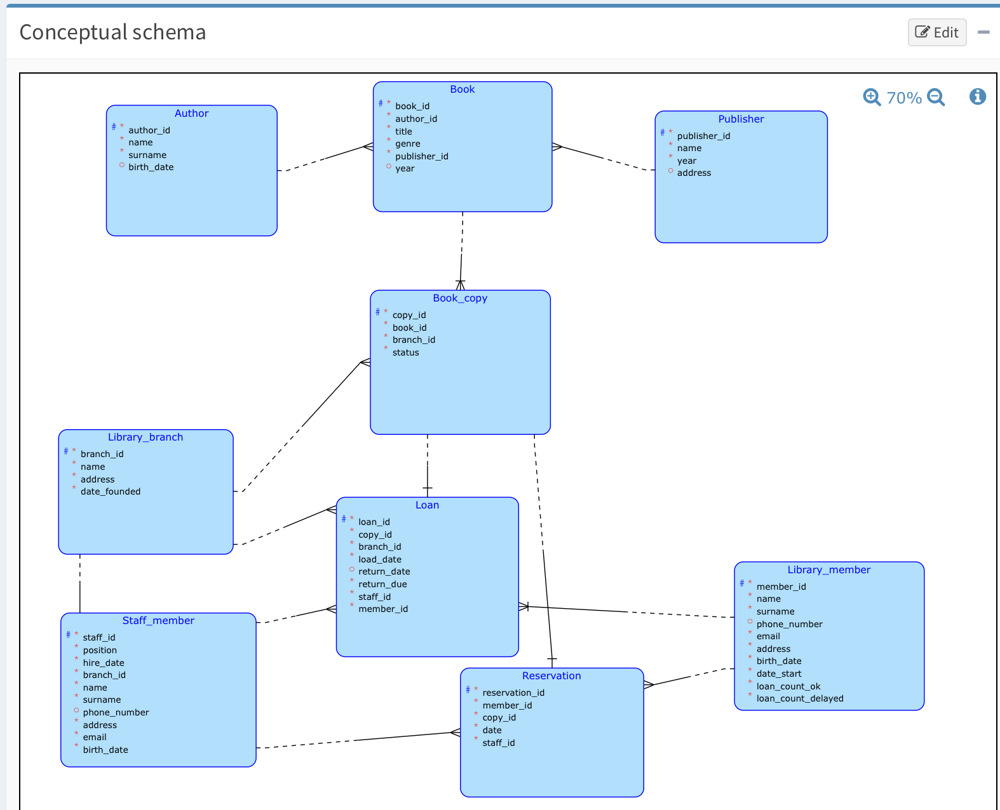

# Library System

A relational database for managing a multi-branch library system — books, members, loans, reservations, and staff.

Built with PostgreSQL. Includes schema, sample data, and 24 queries covering a wide range of SQL features.

Tested on [Railway](https://railway.app).



## Structure

| File         | What it does                                                                    |
| ------------ | ------------------------------------------------------------------------------- |
| `create.sql` | Creates all tables with constraints and foreign keys                            |
| `insert.sql` | Populates tables with sample data (15 branches, 16 books, 15 members, 15 staff) |

## Schema (9 tables)

- **Author / Publisher** — book metadata
- **Book** — original book records
- **Book_copy** — physical copies tied to branches, with availability status
- **Library_branch** — branch locations
- **Library_member** — registered members with loan history counters
- **Staff_member** — employees assigned to branches
- **Loan** — tracks who borrowed what, when, and whether it's been returned
- **Reservation** — pending reservations on book copies

The key design decision is separating `Book` from `Book_copy` — a single book can have multiple physical copies across different branches.

## How to run

1. Run `create.sql` to set up tables
2. Run `insert.sql` to load sample data
3. Run individual queries from `queries.sql`

---

## Query Summary

| #   | Description                                           | Features                                 |
| --- | ----------------------------------------------------- | ---------------------------------------- |
| D1  | Available Fiction books in a branch                   | NATURAL JOIN, subquery in FROM           |
| D2  | Available books by specific author in a branch        | NATURAL JOIN, subquery in FROM           |
| D3  | Currently loaned books by members registered > 1 year | NATURAL JOIN, date arithmetic            |
| D4  | Available books at a branch by address                | NATURAL JOIN                             |
| D5  | All available books with authors                      | CROSS JOIN                               |
| D6  | Members with a specific number of active loans        | JOIN, GROUP BY, HAVING                   |
| D7  | Reservation count for a specific book                 | LEFT JOIN, GROUP BY                      |
| D8  | Staff with most loans in a period                     | JOIN, GROUP BY, ORDER BY, LIMIT          |
| D9  | Update branch address by name                         | UPDATE, nested SELECT                    |
| D10 | Authors with more than 1 book                         | Nested SELECT, GROUP BY, HAVING          |
| D11 | Members who never reserved                            | EXCEPT                                   |
| D12 | Books with reservation count                          | LEFT JOIN, correlated subquery in SELECT |
| D13 | All members and their loans                           | FULL OUTER JOIN                          |
| D14 | Members with no active loans                          | NOT EXISTS                               |
| D15 | Books that are loaned or reserved                     | UNION                                    |
| D16 | Delete all copies of a book                           | DELETE, nested SELECT                    |
| D17 | Books both loaned and reserved                        | INTERSECT                                |
| D18 | Staff with > 1 loan (J1)                              | JOIN, GROUP BY, HAVING                   |
| D19 | Staff with > 1 loan (J2)                              | VIEW                                     |
| D20 | Insert Fiction copies into branch 5                   | INSERT with subquery, ROW_NUMBER()       |
| D21 | Books loaned by a specific member                     | NATURAL JOIN, subquery in FROM           |
| D22 | Available books with branch address                   | NATURAL JOIN, subquery in FROM           |
| D23 | Overdue loans with member info                        | JOIN, LEFT JOIN, date comparison         |
| D24 | Staff with > 1 loan (J3)                              | Correlated subquery                      |

D18, D19, D24 are the same query written three different ways (JOIN, VIEW, correlated subquery).

---

## Queries

### D1 — All available Fiction books in a given branch

**RA:**

```
{
    {
        book_copy * book * author
    }
    [title, genre, name→author_name, surname→author_surname, status, branch_id]
    (branch_id=1 ∧ status = 'Available')
}
*
{
    library_branch[branch_id, name→branch_name]
}
```

**SQL:**

```sql
SELECT DISTINCT *
FROM (
    SELECT DISTINCT *
    FROM (
        SELECT DISTINCT title,
                        genre,
                        name AS author_name,
                        surname AS author_surname,
                        status,
                        branch_id
        FROM BOOK_COPY
        NATURAL JOIN BOOK
        NATURAL JOIN AUTHOR
    ) R1
    WHERE branch_id = 1 AND status = 'Available'
) R2
NATURAL JOIN (
    SELECT DISTINCT branch_id,
                    name AS branch_name
    FROM LIBRARY_BRANCH
) R3;
```

---

### D2 — All available books by a specific author in a given branch

**RA:**

```
{
    book_copy * book * author
}
[title, genre, name→author_name, surname→author_surname, status, branch_id]
(status = 'Available' ∧ author_name='John' ∧ author_surname='Smith' ∧ branch_id = 1)
* library_branch[branch_id, name→branch_name]
```

**SQL:**

```sql
SELECT DISTINCT *
FROM (
    SELECT DISTINCT *
    FROM (
        SELECT DISTINCT title,
                        genre,
                        name AS author_name,
                        surname AS author_surname,
                        status,
                        branch_id
        FROM BOOK_COPY
        NATURAL JOIN BOOK
        NATURAL JOIN AUTHOR
    ) R1
    WHERE status = 'Available' AND author_name = 'John' AND author_surname = 'Smith' AND branch_id = 1
) R2
NATURAL JOIN (
    SELECT DISTINCT branch_id,
                    name AS branch_name
    FROM LIBRARY_BRANCH
) R3;
```

---

### D3 — Currently loaned books by members registered for more than 1 year

**RA:**

```
{
    loan[member_id, copy_id]
    *
    book_copy[copy_id, book_id, status]
    *
    book[book_id, genre, title]
    *
    library_member[member_id, name, surname, date_start]
}
(status='On Loan' ∧ '1.1.2025' - date_start >= 365)
[name, surname, title, genre, date_start]
```

**SQL:**

```sql
SELECT DISTINCT name,
                surname,
                title,
                genre,
                date_start
FROM (
    SELECT DISTINCT member_id,
                    copy_id,
                    return_date
    FROM LOAN
) R1
NATURAL JOIN (
    SELECT DISTINCT copy_id,
                    book_id,
                    status
    FROM BOOK_COPY
) R2
NATURAL JOIN (
    SELECT DISTINCT book_id,
                    genre,
                    title
    FROM BOOK
) R3
NATURAL JOIN (
    SELECT DISTINCT member_id,
                    name,
                    surname,
                    date_start
    FROM LIBRARY_MEMBER
) R4
WHERE status = 'On Loan' AND TO_DATE('01.01.2025','dd.mm.yyyy') - date_start >= 365 AND return_date IS NULL;
```

---

### D4 — All available books at a branch by address

**RA:**

```
{
    book_copy * book * library_branch
}
(status='Available' ∧ address = '600 Center St')
[title, address, status]
```

**SQL:**

```sql
SELECT DISTINCT title,
                address,
                status
FROM BOOK_COPY
NATURAL JOIN BOOK
NATURAL JOIN LIBRARY_BRANCH
WHERE status = 'Available' AND address = '600 Center St';
```

---

### D5 — All available book copies with their authors

**RA:**

```
{
    {
        book_copy(status='Available')
        *
        book
        *
        author
    }
}
[title, genre, name→author_name, surname→author_surname]
```

**SQL:**

```sql
SELECT DISTINCT
    BOOK.title,
    BOOK.genre,
    AUTHOR.name AS author_name,
    AUTHOR.surname AS author_surname
FROM BOOK_COPY
CROSS JOIN BOOK
CROSS JOIN AUTHOR
WHERE BOOK_COPY.status = 'Available'
  AND BOOK_COPY.book_id = BOOK.book_id
  AND BOOK.author_id = AUTHOR.author_id;
```

---

### D6 — Members with a specific number of active loans

**SQL:**

```sql
SELECT
    LIBRARY_MEMBER.member_id,
    LIBRARY_MEMBER.name,
    LIBRARY_MEMBER.surname,
    COUNT(LOAN.loan_id) AS active_loans_count
FROM
    LOAN
JOIN
    LIBRARY_MEMBER ON LOAN.member_id = LIBRARY_MEMBER.member_id
WHERE
    LOAN.return_date IS NULL
GROUP BY
    LIBRARY_MEMBER.member_id,
    LIBRARY_MEMBER.name,
    LIBRARY_MEMBER.surname
HAVING
    COUNT(LOAN.loan_id) = 2;
```

---

### D7 — Number of reservations for a specific book

**SQL:**

```sql
SELECT
    BOOK.book_id,
    BOOK.title,
    COUNT(RESERVATION.reservation_id) AS reservation_count
FROM
    RESERVATION
LEFT JOIN
    BOOK_COPY ON BOOK_COPY.copy_id = RESERVATION.copy_id
LEFT JOIN
    BOOK ON BOOK.book_id = BOOK_COPY.book_id
WHERE
    BOOK.title = 'The Lost City'
GROUP BY
    BOOK.book_id, BOOK.title;
```

---

### D8 — Staff member who processed the most loans in a given period

**SQL:**

```sql
SELECT LOAN.staff_id, name, surname, COUNT(loan_id) AS loan_count
FROM LOAN
JOIN STAFF_MEMBER ON STAFF_MEMBER.staff_id = LOAN.staff_id
WHERE LOAN.load_date BETWEEN TO_DATE('2020-01-01', 'YYYY-MM-DD') AND TO_DATE('2025-01-01', 'YYYY-MM-DD')
GROUP BY LOAN.staff_id, name, surname
ORDER BY loan_count DESC
LIMIT 1;
```

---

### D9 — Update branch address by branch name

**SQL:**

```sql
UPDATE LIBRARY_BRANCH
SET address = '900 Main Street'
WHERE branch_id = (
    SELECT branch_id
    FROM LIBRARY_BRANCH
    WHERE name = 'Highland Branch'
);
```

---

### D10 — Authors who wrote more than 1 book

**SQL:**

```sql
SELECT name, surname
FROM AUTHOR
WHERE author_id IN (
    SELECT author_id
    FROM BOOK
    GROUP BY author_id
    HAVING COUNT(book_id) > 1
);
```

---

### D11 — Members who never made a reservation

**RA:**

```
library_member \ {library_member <* reservation}
```

**SQL:**

```sql
SELECT DISTINCT *
FROM LIBRARY_MEMBER
EXCEPT
SELECT DISTINCT member_id,
                name,
                surname,
                phone_number,
                email,
                address,
                birth_date,
                date_start,
                loan_count_ok,
                loan_count_delayed
FROM LIBRARY_MEMBER
NATURAL JOIN RESERVATION;
```

---

### D12 — All books with their reservation count

**SQL:**

```sql
SELECT
    BOOK.title,
    BOOK.genre,
    (SELECT COUNT(*)
        FROM RESERVATION
        WHERE RESERVATION.copy_id = BOOK_COPY.copy_id) AS reservation_count
FROM BOOK_COPY
LEFT JOIN
    BOOK ON BOOK.book_id = BOOK_COPY.book_id;
```

---

### D13 — All members and their loans (including members with no loans)

**SQL:**

```sql
SELECT
    LIBRARY_MEMBER.member_id,
    LIBRARY_MEMBER.name,
    LOAN.loan_id,
    LOAN.copy_id,
    LOAN.load_date AS loan_date
FROM
    LIBRARY_MEMBER
FULL OUTER JOIN
    LOAN ON LIBRARY_MEMBER.member_id = LOAN.member_id;
```

---

### D14 — Members who currently have no active loans

**SQL:**

```sql
SELECT
    LIBRARY_MEMBER.member_id,
    LIBRARY_MEMBER.name,
    LIBRARY_MEMBER.surname
FROM
    LIBRARY_MEMBER
WHERE
    NOT EXISTS (
        SELECT 1
        FROM LOAN
        WHERE LOAN.member_id = LIBRARY_MEMBER.member_id
          AND LOAN.return_date IS NULL
    );
```

---

### D15 — Unique list of books that are loaned or reserved

**RA:**

```
{
    book * book_copy(status='On Loan')
}[title, book_id]
∪
{
    reservation * book_copy * book
}[title, book_id]
```

**SQL:**

```sql
SELECT DISTINCT title,
                book_id
FROM BOOK
NATURAL JOIN (
    SELECT DISTINCT *
    FROM BOOK_COPY
    WHERE status = 'On Loan'
) R1
UNION
SELECT DISTINCT title,
                book_id
FROM RESERVATION
NATURAL JOIN BOOK_COPY
NATURAL JOIN BOOK;
```

---

### D16 — Delete all copies of a specific book

**SQL:**

```sql
DELETE FROM BOOK_COPY
WHERE book_id IN (
    SELECT book_id
    FROM BOOK
    WHERE title = 'Philosophy Today'
);
```

---

### D17 — Books that are both loaned and reserved

**RA:**

```
{
    book[book_id, title]
    *
    book_copy
    *
    reservation
}[book_id, title]
∩
{
    {
        book[book_id, title]
        *
        book_copy
    }
    (status='On Loan')
    [book_id, title]
}
```

**SQL:**

```sql
SELECT DISTINCT book_id,
                title
FROM BOOK
NATURAL JOIN BOOK_COPY
NATURAL JOIN RESERVATION
INTERSECT
SELECT DISTINCT book_id,
                title
FROM BOOK
NATURAL JOIN BOOK_COPY
WHERE status = 'On Loan';
```

---

### D18 — Staff with more than 1 loan processed (J1 — JOIN)

**SQL:**

```sql
SELECT LOAN.staff_id, name, surname, COUNT(loan_id) AS loan_count
FROM LOAN
JOIN STAFF_MEMBER ON STAFF_MEMBER.staff_id = LOAN.staff_id
WHERE LOAN.load_date BETWEEN TO_DATE('2020-01-01', 'YYYY-MM-DD') AND TO_DATE('2025-01-01', 'YYYY-MM-DD')
GROUP BY LOAN.staff_id, name, surname
HAVING COUNT(loan_id) > 1
ORDER BY loan_count DESC;
```

---

### D19 — Staff with more than 1 loan processed (J2 — VIEW)

**SQL:**

```sql
CREATE OR REPLACE VIEW EMPLOYEE_WITH_MORE_THAN_1_LOAN AS
SELECT LOAN.staff_id, name, surname, COUNT(loan_id) AS loan_count
FROM LOAN
JOIN STAFF_MEMBER ON STAFF_MEMBER.staff_id = LOAN.staff_id
WHERE LOAN.load_date BETWEEN TO_DATE('2020-01-01', 'YYYY-MM-DD') AND TO_DATE('2025-01-01', 'YYYY-MM-DD')
GROUP BY LOAN.staff_id, name, surname;

SELECT staff_id, name, surname, loan_count
FROM EMPLOYEE_WITH_MORE_THAN_1_LOAN
WHERE loan_count > 1
ORDER BY loan_count DESC;
```

---

### D20 — Insert copies of all Fiction books into branch 5

**SQL:**

```sql
INSERT INTO book_copy (copy_id, book_id, branch_id, status)
SELECT
    (SELECT MAX(copy_id) FROM book_copy) + ROW_NUMBER() OVER (ORDER BY b.book_id),
    b.book_id,
    5,
    'Available'
FROM book b
WHERE b.genre = 'Fiction';
```

---

### D21 — All books currently loaned by a specific member

**RA:**

```
{
    loan[member_id, load_date, return_due, copy_id]
    *
    book_copy[book_id, copy_id]
    *
    book[book_id, genre, title]
}
(member_id = 5)
```

**SQL:**

```sql
SELECT DISTINCT *
FROM (
    SELECT DISTINCT member_id,
                    load_date,
                    return_due,
                    copy_id
    FROM LOAN
) R1
NATURAL JOIN (
    SELECT DISTINCT book_id,
                    copy_id
    FROM BOOK_COPY
) R2
NATURAL JOIN (
    SELECT DISTINCT book_id,
                    genre,
                    title
    FROM BOOK
) R3
WHERE member_id = 5;
```

---

### D22 — All available books with their branch address

**RA:**

```
{
    {
        book_copy[book_id, branch_id, status]
        (status='Available')
        *
        book
    }
    *
    library_branch
}
[title, genre, address]
```

**SQL:**

```sql
SELECT DISTINCT title,
                genre,
                address
FROM (
    SELECT DISTINCT *
    FROM (
        SELECT DISTINCT book_id,
                        branch_id,
                        status
        FROM BOOK_COPY
    ) R1
    WHERE status = 'Available'
) R2
NATURAL JOIN BOOK
NATURAL JOIN LIBRARY_BRANCH;
```

---

### D23 — Overdue loans with member info

**SQL:**

```sql
SELECT name, surname, title, return_due, CURRENT_DATE AS date_today
FROM loan
JOIN library_member ON loan.member_id = library_member.member_id
LEFT JOIN book_copy ON loan.copy_id = book_copy.copy_id
LEFT JOIN book ON book_copy.book_id = book.book_id
WHERE loan.return_due < CURRENT_DATE
  AND loan.return_date IS NULL;
```

---

### D24 — Staff with more than 1 loan processed (J3 — correlated subquery)

**SQL:**

```sql
SELECT DISTINCT
    staff_id,
    name,
    surname,
    (
        SELECT COUNT(*)
        FROM loan
        WHERE loan.staff_id = staff_member.staff_id
          AND loan.load_date BETWEEN TO_DATE('2020-01-01', 'YYYY-MM-DD') AND TO_DATE('2025-01-01', 'YYYY-MM-DD')
    ) AS loan_count
FROM
    staff_member
WHERE
    (
        SELECT COUNT(*)
        FROM loan
        WHERE loan.staff_id = staff_member.staff_id
          AND loan.load_date BETWEEN TO_DATE('2020-01-01', 'YYYY-MM-DD') AND TO_DATE('2025-01-01', 'YYYY-MM-DD')
    ) > 1;
```
